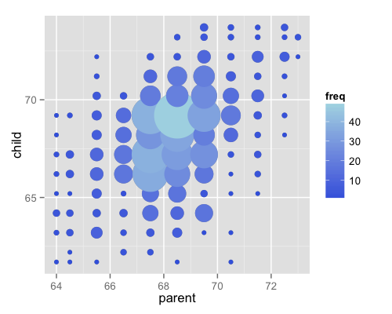
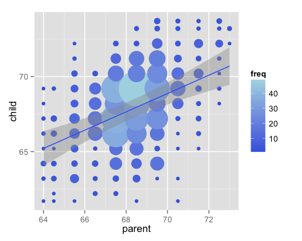
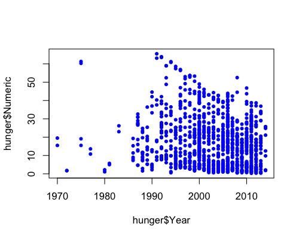
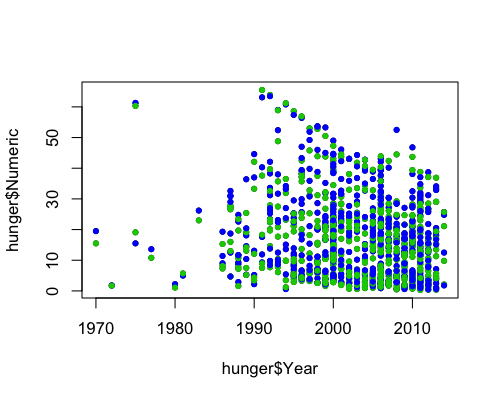
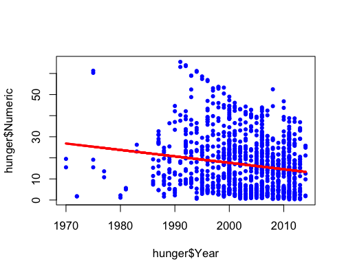
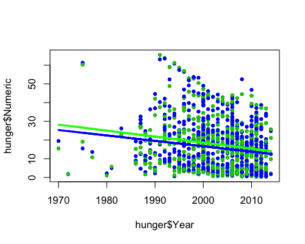
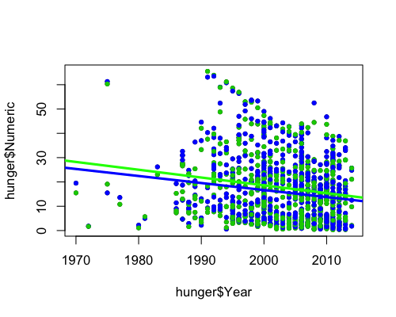

## Parte 1

## Modelo Lineal Univariado

---

## Datos de Galton (Complemento Laboratorio 3)

Considere nuevamente los datos de estatura de padres e hijos

<div class="rimage center"></div>

---

## Ajuste de la mejor recta de regresión

* Sea $Y_i$ la estatura del hijo $i^{th}$ y $X_i$ la estatura del padre $i^{th}$. 
* Considere la recta con mejor ajuste $Y_i = \beta_0 + \beta_1 X_i + \varepsilon_i$.
* La ecuación de mínimos cuadrados es $$\sum_{i=1}^n [Y_i - (\beta_0 + \beta_1 X_i)]^2.$$

---

## Resultados

* El modelo de mínimos cuadrados ajusta la recta $Y = \beta_0 + \beta_1 X$ a través de los pares ordenados $(X_i, Y_i)$ e $Y_i$ es el output que se obtiene de la recta $Y = \hat \beta_0 + \hat \beta_1 X$ con
  $$\hat \beta_1 = Cor(Y, X) \frac{Sd(Y)}{Sd(X)} ~~~ \hat \beta_0 = \bar Y - \hat \beta_1 \bar X.$$
* $\hat \beta_1$ se expresa en unidades de $Y / X$, $\hat \beta_0$ se expresa en unidades de $Y$.
* La recta de regresión pasa por $(\bar X, \bar Y)$.
* La pendiente de la recta de regresión con $X$ como output e $Y$ como input es $Cor(Y, X) \frac{Sd(X)}{Sd(Y)}$. 
* La pendiente es la misma que se obtiene que si se centraran los datos $(X_i - \bar X, Y_i - \bar Y)$ y se estimara una regresión que pasa por $(0,0)$.
* Si se normalizan los datos, $\left( \frac{X_i - \bar X}{Sd(X)}, \frac{Y_i - \bar Y}{Sd(Y)} \right)$, le pendiente es $Cor(Y, X)$.

---

## Álgebra vs Comandos

Comparando los cálculos en R


```r
y <- galton$child
x <- galton$parent
beta1 <- cor(y, x) *  sd(y) / sd(x)
beta0 <- mean(y) - beta1 * mean(x)
rbind(c(beta0, beta1), coef(lm(y ~ x)))
```

```
     (Intercept)         x
[1,]    23.94153 0.6462906
[2,]    23.94153 0.6462906
```

---

## Álgebra vs Comandos

Invirtiendo la relación entre las variables


```r
beta1 <- cor(y, x) *  sd(x) / sd(y)
beta0 <- mean(x) - beta1 * mean(y)
rbind(c(beta0, beta1), coef(lm(x ~ y)))
```

```
     (Intercept)         y
[1,]    46.13535 0.3256475
[2,]    46.13535 0.3256475
```

---

## Revisando los datos de Galton (1)

La regresión desde el origen tiene la misma pendiente si primero centramos los datos


```r
yc <- y - mean(y)
xc <- x - mean(x)
beta1 <- sum(yc * xc) / sum(xc ^ 2)
c(beta1, coef(lm(y ~ x))[2])
```

```
                  x 
0.6462906 0.6462906 
```

---

## Revisando los datos de Galton (2)

Si se normalizan los datos la pendiente es el coeficiente de correlación


```r
yn <- (y - mean(y))/sd(y)
xn <- (x - mean(x))/sd(x)
c(cor(y, x), cor(yn, xn), coef(lm(yn ~ xn))[2])
```

```
                           xn 
0.4587624 0.4587624 0.4587624 
```

---

## Resultados

Mejor recta de regresión

<div class="rimage center"></div>

---

## Parte 2

## Modelo Lineal Multivariado

---

## Extensión del caso univariado

* El modelo lineal generalizado extiende el modelo lineal simple (SLR) agregando términos linealmente al modelo. Típicamente $X_{1i}=1$ (se incluye un intercepto).
$$
Y_i =  \beta_1 X_{1i} + \beta_2 X_{2i} + \ldots +
\beta_{p} X_{pi} + \epsilon_{i} 
= \sum_{k=1}^p X_{ik} \beta_j + \varepsilon_{i}.
$$
* La estimación por OLS (y también la estimación por ML bajo supuestos de iid y los errores Gaussianos) minimiza
$$
\sum_{i=1}^n \left(Y_i - \sum_{k=1}^p X_{ki} \beta_j\right)^2.
$$
* Lo importante es la linealidad de los coeficientes, entonces
$$
Y_i =  \beta_1 X_{1i}^2 + \beta_2 X_{2i}^2 + \ldots +
\beta_{p} X_{pi}^2 + \varepsilon_{i}. 
$$
también es un modelo lineal (aunque los regresores sean términos cuadráticos).

---

## Interpretación de los coeficientes

$$E[Y | X_1 = x_1, \ldots, X_p = x_p] = \sum_{k=1}^p x_{k} \beta_k$$

$$
E[Y | X_1 = x_1 + 1, \ldots, X_p = x_p] = (x_1 + 1) \beta_1 + \sum_{k=2}^p x_{k} \beta_k
$$

$$
E[Y | X_1 = x_1 + 1, \ldots, X_p = x_p]  - E[Y | X_1 = x_1, \ldots, X_p = x_p]$$
$$= (x_1 + 1) \beta_1 + \sum_{k=2}^p x_{k} \beta_k + \sum_{k=1}^p x_{k} \beta_k = \beta_1 $$
Un coeficiente de regresión multivariada es el cambio esperado en el output ante un cambio en una unidad en el regresor correspondiente, manteniendo todos los demás regresores fijos.

---

## Tasas de hambre en la población infantil (1)

Instancia de trabajo

```r
#link descarga 
#http://apps.who.int/gho/athena/data/GHO/WHOSIS_000008.csv
setwd("/Users/pacha/analisis-de-datos-unab/laboratorio4/")
hunger <- read.csv("hunger.csv")
hunger <- hunger[hunger$Sex!="Both sexes",]
```

---

## Tasas de hambre en la población infantil (2)

Sin controlar por género:
<div class="rimage center"></div>

---

## Tasas de hambre en la población infantil (3)

Controlando por género (azul = niñas, verde = niños):
<div class="rimage center"></div>

---

## Modelo univariado (1)

Sin controlar por género:

$$Hu_i = b_0 + b_1 Y_i + e_i$$

$b_0$ = % de hambre en el año 0

$b_1$ = disminución del % de hambre por año

$e_i$ = todas las variables no medidas

---

## Modelo univariado (2)

<div class="rimage center"></div>

---

## Modelo univariado (3)

Controlando por género:

$$HuF_i = bf_0 + bf_1 YF_i + ef_i$$

$bf_0$ = % de hambre en las niñas en el año 0

$bf_1$ = disminución del % de hambre por año en las niñas

$ef_i$ = todas las variables no medidas


$$HuM_i = bm_0 + bm_1 YM_i + em_i$$

$bm_0$ = % de hambre en los niños en el año 0

$bm_1$ = disminución del % de hambre por año en las niños

$em_i$ = todas las variables no medidas

---

## Modelo univariado (4)

<div class="rimage center"></div>

---

## Modelo multivariado (1)

Las dos rectas anteriores tienen la misma pendiente. Vamos a estimar el siguiente modelo:

$$Hu_i = b_0 + b_1 M_i + b_2 Y_i + e^*_i$$

$b_0$ = % de hambre en las niñas en el año 0

$M_i$ = $\begin{cases} 1 &\text{si es niño} \cr 0 &\text{si es niña} \end{cases}$

$b_0 + b_1$ = % de hambre en las niños en el año 0

$b_2$ = disminución del % de hambre por año en niños o niñas

$e^*_i$ = todas las variables no medidas

---

## Modelo multivariado (2)

<div class="rimage center"></div>

---

## Modelo multivariado (3)

$$Hu_i = b_0 + b_1 M_i + b_2 Y_i + b_3 (M_i \cdot Y_i) + e^+_i$$

$b_0$ = % de hambre en las niñas en el año 0

$M_i$ = $\begin{cases} 1 &\text{si es niño} \cr 0 &\text{si es niña} \end{cases}$

$b_0 + b_1$ = % de hambre en las niños en el año 0

$b_2$ = disminución del % de hambre por año en niños o niñas

$b_2 + b_3$ = disminución del % de hambre por año en los niños

$e^+_i$ = todas las variables no medidas

---

## Modelo multivariado (4)

<div class="rimage center"></div>

---

## Resultados


```r
coefficients(lmBoth)
```

```
               (Intercept)                hunger$Year             hunger$SexMale 
              595.83543620                -0.28958348                64.74249171 
hunger$Year:hunger$SexMale 
               -0.03139868 
```

---

## Ejercicio

Usando la encuesta <a href="http://pachamaltese.github.io/analisis-de-datos-unab/laboratorio4/casen2013.dta.zip">CASEN 2013</a> estime un modelo log-lineal
$$ 
\log(y_i) = \beta_0 + \sum_{i=1}^n \beta_i x_i + \varepsilon_i
$$
que permita predecir el salario por hora de las personas de entre 35 y 45 años en función de las variables sexo, escolaridad, experiencia laboral, si la persona reside en la Región Metropolitana y si trabaja en la Administración Pública. Extienda los resultados de su regresión a la población del país.
